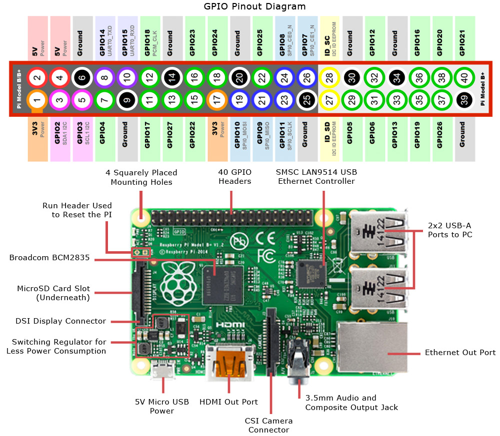

# Doel van het project

Bij dit project worden schakelsets aangestuurd over 433mhz radio met een Raspberry Pi.
De 433mhz frequentie wordt gebruikt door o.a. de schakelsets van KlikAanKlikUit (afk. KaKu) en die van Action.

# Inhoud

* [Benodigdheden](#benodigdheden)
* [Hardware](#hardware)
* [Software](#software)

## Benodigdheden

### Onderdelen

* Raspberry pi (model naar keuze) met voeding en SD-kaart
* 433mhz transmitter (ontvanger niet vereist)
* Female-to-female jumper kabel x3

### Gereedschap

Er is geen bijzonder gereedschap nodig voor dit project.

## Hardware

De hardware setup van dit project is uitermate eenvoudig.

* Sluit de voedings pin van de transmitter aan op pin 4 van de pi (VCC 5v).
* Sluit de aarde pin van de transmitter aan op pin 6 van de pi (GND).
* Sluit de datapin van de transmitter aan op pin 8 van de pi (TX).

## Software

Om signalen uit te zenden voor de lampen gebruiken we de [RemoteLights library](https://bitbucket.org/fuzzillogic/433mhzforarduino/wiki/Home), geschreven door Randy Simons.
Deze kan gebruikt worden door C++ code, of er kan een command line tool van gebouwd worden. De command line tool is het eenvoudigst om te combineren met je eigen programma in een andere programmeertaal dan C++. Je hebt alleen wel de overhead dat er iedere keer een shell gespawned moet worden.

### Installatie

Zie de [readme van het project mqtt-433mhz-bridge](https://github.com/syntax-workshops/mqtt-433mhz-bridge/blob/master/README.md) voor
installatie instructies. Het is vrij beknopt (alleen de commando's die je moet uitvoeren), maar wel getest.

# Bronnen

* http://weejewel.tweakblogs.net/blog/8665/lampen-schakelen-met-een-raspberry-pi.html
* http://eeo.tweakblogs.net/blog/11427/rpi2-bugfix-kaku-lampen
* https://bitbucket.org/fuzzillogic/433mhzforarduino/wiki/Home
