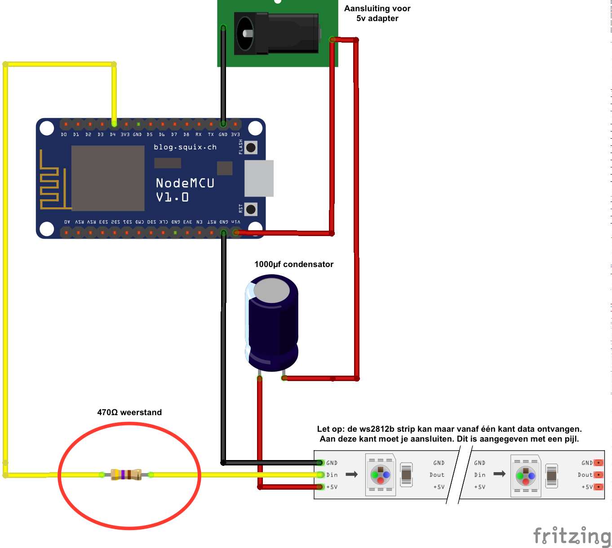

# Doel van het project

Bij dit project stuur je een RGB LED strip (ws2812b) aan met een Nodemcu microcontroller (gebaseerd op de esp8266 SoC). De LED strip is een lange strook met felle LED's erop, die je *individueel* in een willekeurige kleur licht kunt laten geven.

De Nodemcu beschikt over wifi, waardoor je de LED strip met een (open-source) smartphone app kunt besturen.
Het is ook mogelijk om fysieke bedieningsknoppen toe te voegen aan dit project. Maar om het simpel te houden beperken wij ons nu tot bediening via het netwerk.

# Inhoud

* [Over de esp8266 microcontroller](#over-de-esp8266)
* [Benodigdheden](#benodigdheden)
* [Hardware](#hardware)
  * [Aansluiten](#aansluiten)
* [Software](#software)
  * [Firmware flashen](#aansluiten)
  * [Espixel installeren](#)
  * [Aansturen via Python](#)
  * [Smartphone apps](#apps)

# Over de esp8266

De esp8266 is een microcontroller die in 2014 is uitgebracht door Espressif Systems. Het is een betaalbare module, ontworpen om elektronica eenvoudig met het internet te verbinden (*internet of things*).
Het kan net als een Arduino geprogrammeerd worden in C met de Arduino IDE. Ook is er een Nodemcu firmware die gebaseerd is op Lua. Hiermee kun je de module programmeren met Lua scripts.

De belangrijkste features die het biedt zijn:

* Ingebouwde WiFi en een netwerk stack
* 12 GPIO (general purpose input/output) pins
* ADC (analog to digital converter) pin
* 4Mb flash geheugen

# Benodigdheden

## Onderdelen

* Nodemcu dev board
* ws2812b LED strip (RGB)
* 5v voeding van 4a (ampere) of meer, afhankelijk van de led strip
* Perfboard
* Generiek aansluit kabel (koper)
* Condensator van 1000µf (micro farad)
* Weerstand van 470Ω (ohm) (optioneel)
* Voedings tonnetje

## Gereedschappen

* Soldeerbout of liever een soldeerstation
* Draden strip tang
* Fijne knijptang
* Schaar

# Hardware

In deze handleiding gebruiken we de Nodemcu developer kit. Dit apparaatje voegt nuttige functionaliteit toe aan een "kale" esp-12e module, namelijk een micro-USB aansluiting, 5 volt regulator en een on-board programmer.
Hierdoor heb je geen losse USB FTDI of *voltage regulator* nodig.

De pin aansluitingen op de module zijn als volgt:


## Voeding

De esp8266 SoC gebruikt weinig stroom; maximaal 400 mA (milliampere) op 3,3 volt. De nodemcu accepteert net als de strip 5v en zet dit automatisch om.

De LED strip is echter zeer hongerig voor stroom. Reken op *x* mA per LED. De strips die we voor deze workshop aanbevelen hebben 30 LED's per meter.
**TODO**: Stroom vereisten

## Aansluiten

Het aansluiten van dit project gaat als volgt:



# Software

Je hebt twee opties om je module te programmeren:

* C (met Arduino API's)
* Lua (met nodemcu API's)

Voor de workshop gebruiken we Lua, omdat dit aanzienlijk makkelijker is om mee te beginnen dan C.

C is echter een uitstekende keuze als performance belangrijk is, of je (low-level) dingen wilt doen die in Nodemcu Lua niet kunnen.

## Firmware flashen

TODO: Esptool, luatool

## Lua programma installeren

[De code voor LedControl.Nodemcu staat op GitHub](https://github.com/syntax-workshops/LedControl.Nodemcu).
Zie de instructies in de README voor installatie.

## Aansturen via Python

```python
# add code here
```

## Apps

Voor dit project zijn open-source apps gebouwd voor iOS en Android. Bekijk de source code en instructies hier:

* [iOS](https://github.com/syntax-workshops/LedControl.iOS)
* [Android](https://github.com/syntax-workshops/LedControl.Android)

# Bronnen

* [LED strip aansluiten op een Arduino](https://learn.adafruit.com/adafruit-neopixel-uberguide/basic-connections)

## Handige software tools

* [Flashen van je firmware](https://github.com/themadinventor/esptool)
* [Uploaden van lua code](https://github.com/4refr0nt/luatool)

## Hardware specificaties

* [Nodemcu dev kit specificiaties](https://github.com/nodemcu/nodemcu-devkit-v1.0)

## API Documentatie

* [Nodemcu docs](http://nodemcu.readthedocs.org/en/dev/en/upload/)
